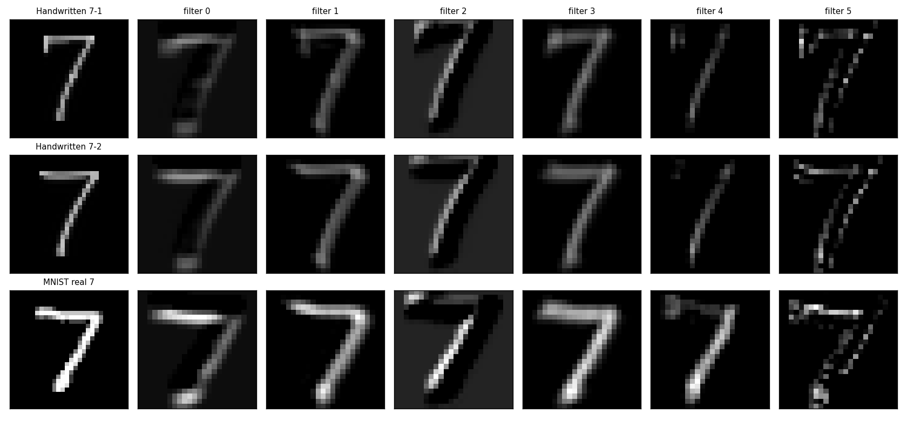
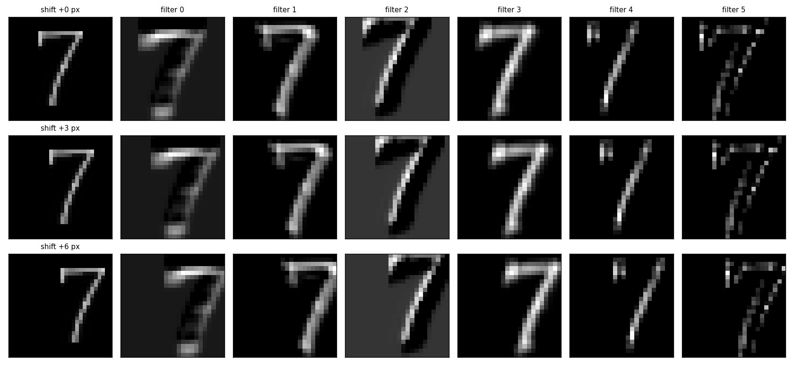

# 我学深度学习入门的练习文件夹

MNIST 手写数字分类，从最简单的模型开始，一个一个往上加，
**每个改动都做控制变量实验**。

## 文件

| 文件 | 内容 |
|---|---|
| **`model.py`** | **模型结构定义**（`class MyCNN(nn.Module)`）—— 所有脚本共用这一份 |
| `mnist_softmax.py` | 训练脚本（当前是 CNN） |
| `predict.py` | 加载已保存的模型，预测任意图片 |
| `exp_translation.py` | 平移实验：对比 MLP 与 CNN 的平移鲁棒性 |
| `feature_maps.py` | 特征图可视化：三张不同的 7 的第一层 6 张特征图 |
| `shift_feature_maps.py` | 平移等变性验证：同一张 7 右移 0/3/6 像素 |
| `mnist_cnn.pth` | 训练好的 CNN 权重（不提交，`.gitignore` 已挡） |
| `mnist_mlp.pth` | 训练好的 MLP 权重（同上） |

**当前最好结果：测试集 99.06%**（CNN，34,622 参数）

---

## 实验一：隐藏层与激活函数

同一份数据、同样的超参数（`lr=0.1`、`batch=64`、`epochs=10`），**只改模型结构**：

| 模型 | 参数量 | 测试集准确率 |
|---|---|---|
| `Linear(784, 10)` | 7,850 | 92.20% |
| `Linear(784,128) → Linear(128,10)`（**无激活函数**） | 101,770 | 92.38% |
| `Linear(784,128) → ReLU → Linear(128,10)` | 101,770 | **97.49%** |

**结论**

- 第 2、3 行**参数量完全相同**，唯一区别是有无 ReLU，准确率相差 **5.11 个百分点**
- 没有激活函数时，多层线性网络等价于单层线性模型 ——
  第 2 行（92.38%）与单层（92.20%）几乎持平，印证了 `W₂(W₁x) = (W₂W₁)x`
- **起作用的是非线性，不是参数量**

---

## 实验二：训练轮数对过拟合的影响

模型不变（`784 → 128 → ReLU → 10`），**只改训练轮数**：

| 轮数 | 训练集 | 测试集 | 训练-测试差距 |
|---|---|---|---|
| 10 | 98.32% | 97.49% | 0.83% |
| 30 | **99.84%** | **98.05%** | **1.79%** |

**多训练 20 轮：训练集涨了 1.52%，测试集只涨了 0.56%。**

训练集的收益越来越难以转化为测试集的收益，这是**过拟合**的表现。
（测试集并未下降，属于早期阶段 —— 差距扩大，但还没到掉头的程度。）

---

## 一个失败案例（这个实验最有意思）

训练好的 MLP（测试集 98.05%）在两张**自己生成的手写 7** 上失败：

| 图片 | MLP 预测 | 7 的概率 |
|---|---|---|
| `7.png` | ❌ 猜成 **2** | **0.0021** |
| `7.1.png` | ❌ 猜成 **2** | **0.0019** |

**注意：不是"犹豫"，是"笃定"——它完全不认为这是 7。**

排查过程（逐项排除）：

| 假设 | 怎么排除的 |
|---|---|
| 预处理有问题？ | MNIST 真图走一遍同样的预处理，几乎不变 → 预处理正确 |
| 笔画太细？ | 把 MNIST 真 7 腐蚀到同样细 → 仍然认对 |
| 灰度 / 对比度？ | 二值化、提亮对比度 → 仍然错 |
| 形状不对？ | 逐像素打印对比 → 形状几乎一模一样 |

**最后换模型（见实验三），两张图全部答对。**

---

## 实验三：换成 CNN

| 模型 | 参数量 | 训练集 | 测试集 | 差距 | 错误率 |
|---|---|---|---|---|---|
| MLP（全连接） | 101,770 | 99.84% | 98.05% | 1.79% | 1.95% |
| **CNN（卷积）** | **34,622** | 99.99% | **99.06%** | **0.93%** | **0.94%** |

**参数少了 66%，错误率几乎减半，训练/测试差距还缩小了 48%。**

同时，那个失败案例里的两张 7：

| 图片 | MLP | CNN |
|---|---|---|
| `7.png` | ❌ 2 | ✅ **7（85.2%）** |
| `7.1.png` | ❌ 2 | ✅ **7（99.1%）** |

**这正是论文里那句话的实证**：

> *"The weight sharing technique has the interesting side effect of reducing the
> number of free parameters, thereby reducing the capacity of the machine and
> reducing the gap between test error and training error."*

---

## 实验四：平移实验

把测试图整体向右平移 k 个像素，看两个模型的准确率怎么变：

| 平移量 | MLP | CNN | 差距 |
|---|---|---|---|
| 0 像素 | 97.95% | 99.06% | +1.11 |
| 1 像素 | 96.47% | 98.81% | +2.34 |
| 2 像素 | 87.14% | 97.09% | +9.95 |
| **3 像素** | **63.82%** | **90.28%** | **+26.46** |
| 5 像素 | 19.03% | 47.47% | +28.44 |

**MLP 在平移 2 像素时开始明显下滑，3 像素崩掉三分之一。**

**结论**：CNN 的平移鲁棒性明显更强 —— 来自卷积的**权值共享**
（同一个卷积核在图上任何位置都能用）。

**但要小心一个常见的过度简化**：

> ⚠️ CNN 有「平移**鲁棒性**」，**不是**「平移**不变性**」。
> 平移 5 像素时它也掉到了 47%。

原因有三：① 卷积是平移**等变**而非不变；② `MaxPool2d(2)` 只在 2×2 窗口内不变；
③ **最后的全连接层又把位置敏感带回来了** —— 这也是后来 NiN / ResNet
用全局平均池化替代全连接层的原因之一。

---

## 实验五：特征图可视化 —— 卷积层到底在找什么

前四组实验看的都是**准确率**，这组直接看**中间层**。

用三张不同的 7（自己手写的 `7.png` / `7.1.png` + 一张 MNIST 真图），
把第一层卷积输出的 6 张特征图（24×24）画出来并排对比：



**尺寸是怎么来的**

- `28 − 5 + 1 = 24` —— 卷积核 5×5、无 padding、步长 1，窗口在 28 宽的图上只能滑 24 个位置
- `Conv2d(1, 6, 5)` 里有 **6 个不同的核** → 6 张特征图

**每个数字的含义**：第 k 张特征图的第 (i, j) 个像素 ＝
原图从 (i, j) 开始的 **5×5 小块**与第 k 个核的点积（再过 ReLU）。
所以「值大」= 那个 5×5 小块长得像这个核的图案。

**6 个核分工明确**：

| 核 | 在找什么 | 证据 |
|---|---|---|
| **有一个** | **背景 / 空白** | 背景区响应 **0.41**，笔画区只有 **0.18** —— 它是**反的** |
| 其余几个 | 笔画 / 边缘 | 特征图上能直接看出「7」的形状 |

> ⚠️ **注意我写的是「有一个核」，不是「filter 0」—— 因为编号是随机的。**
>
> 第一次训练时，是 `filter 0` 学成了背景检测器。后来为了修一个 bug 重新训练，
> **变成 `filter 2` 了**，两者角色刚好对调。
>
> **所以「filter 0 是背景检测器」这句话是错的。** 正确的说法是：
> **「6 个核里总有一个会学成背景检测器」** —— 但**哪个编号是它，每次训练都不一样**。
>
> 📌 **可视化看到的是「这一次训练」的样子，结论必须是「每次都成立」的规律。**
> （这一点和实验四里「训练准确率 0.9994 又变回 0.9991」是同一类问题 —— 神经网络里到处是随机性。）

**⚠️ 一条必须说清楚的边界**：

> 第一层的「局部性」是**架构写死的**，不是学出来的 ——
> `Conv2d(1, 6, 5)` 的 5×5 感受野**跟训练无关**，随机初始化的卷积层也一样。
> 训练真正决定的是「**每个核长成什么样**」（背景检测器 / 边缘检测器），
> 而不是「它只看 5×5」这件事。

**可视化时踩的坑**：`imshow` 默认把**每张图自己的 min/max** 当色标两端，
等于每张图都被独立拉伸到满量程 → **亮度不能跨图比较**。
必须显式传 `vmin` / `vmax`（这里让**同一个 filter 的三行共用一把尺子**）。

---

## 实验六：平移等变性验证

实验四的结论里说「卷积是平移**等变**而非不变」，这组用特征图把它直接看出来。

拿**同一张** 7，右移 0 / 3 / 6 像素 —— **唯一变量是位置**（形状、粗细、灰度都不动）：



> ⚠️ **顺序很重要**：必须**先 `preprocess` 得到 28×28 张量，再平移**。
> 反过来（先平移原图再 `preprocess`）不行 —— 预处理会重新裁剪并居中，
> **把平移量直接抵消掉**。

**验证方法**：把基准的特征图**也平移 s 像素**，再和平移 s 后的特征图逐像素比较。

| | 对齐后误差 | 未对齐误差 |
|---|---|---|
| 6 个 filter × 平移 3 / 6 像素（共 12 组） | **全部 0.0000** | 0.019 ~ 0.533 |

**对齐后误差为 0** = 图案原样没变，**只是整体挪了位置**。

### 踩过的坑：边界效应

平移后右边补了 0，那几列和原图**本来就不可比**，只能比内部区域。

第一版比较区间写成 `[:, :n]`（**把补 0 的列也算进去了**），结果 `filter0` 的误差是 **0.06**、
`filter3` 是 **0.037**，而其他四个都是 0.001 量级。

排查发现：`filter0` 是**背景检测器**，背景响应 0.42 —— 补 0 的区域和它正常的背景响应
对不上，`0.42 × 3/21 ≈ 0.06`，**正好对上**。把区间改成 `[:, s:s+n]`（只比内部）后全部归零。

### 结论

| | 含义 | 卷积层具备吗 |
|---|---|---|
| 平移**等变** equivariant | 输入平移 → 特征图**也跟着平移** | ✅（误差 0.0000） |
| 平移**不变** invariant | 输入平移 → 输出**完全不变** | ❌ |

> **「等变」恰恰意味着「特征跑到别处去了」。**
>
> 这就是实验四里 CNN 也会从 98.97% 掉到 46.20% 的机制 ——
> 卷积层忠实地把 7 平移了，但最后的**全连接层**是看「特征落在 4×4 网格的哪一格」
> 来分类的，格子一变它就懵了。

---

## 运行

```bash
pip install torch torchvision

python mnist_softmax.py                    # 训练（约 4 分钟）
python predict.py 图片路径                  # 用训练好的模型预测
python predict.py --test                   # 从 MNIST 测试集抽一张验证
python exp_translation.py                  # 平移实验（实验四）

python feature_maps.py                     # 特征图可视化（实验五）
python shift_feature_maps.py               # 平移等变性验证（实验六）
```

首次运行会自动下载 MNIST 数据集（约 11 MB）。

**关于最后两个脚本的图片输入**：它们读的是我自己手写的 `7.png` / `7.1.png`
（默认在桌面上，代码里用 `HERE/../..` 定位）。没有这两个文件的话，
把 `IMAGES` / `base` 那几行的路径改成 `_debug/7_28x28.png`、`_debug/7.1_28x28.png` 即可
（那两张已经在仓库里）。
